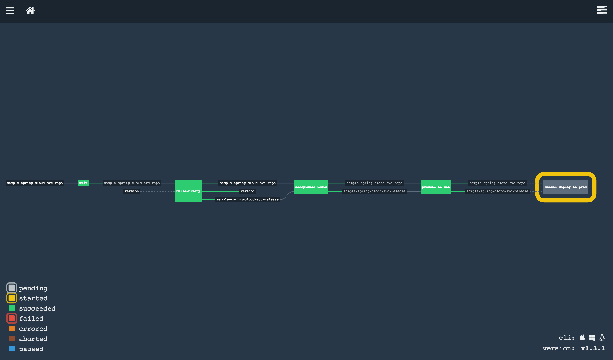

# Using Concourse



* [Concourse](http://councourse.ci)
  * Build only once and deploy anywhere
  * Every build is a release candidate
  * Every build step runs inside a docker container mounted to garden linux cell

## Resources

Resources in concourse are implemented as docker images which contain implementations corresponding their types

* sample-spring-cloud-svc-repo ([git-resource](https://github.com/concourse/git-resource)): A Git resource. Tracks the commits in a Git repository (e.g. [sample-spring-cloud-svc-ci](https://github.com/malston/sample-spring-cloud-svc-ci)).

* sample-spring-cloud-svc-release (([S3-resource](https://github.com/concourse/S3-resource))) A bucket in S3 that stores an artifact (e.g. `build/libs/sample-spring-cloud-svc-ci-1.0.1.jar`). Objects are versioned by pattern-matching filenames to identify version numbers.

* version ([semver-resource](https://github.com/concourse/semver-resource)): A resource for managing a version number. A file named `current-version` is created  in S3 to track the version (e.g. `1.0.1`).

## Pipeline Progress

### Check out resource

### Unit test

This step runs on a container with (gradle or maven) and java installed.
Basically it just runs "gradle test" against the [sample-spring-cloud-svc-repo](https://github.com/malston/sample-spring-cloud-svc-ci).

### Build artifact

* sample-spring-cloud-svc-repo - Check out the same source version of this repo as unit step
* version - Checkout the version file from S3
* "gradle assemble" generates the war artifact
* Push the artifact to the S3 resource as sample-spring-cloud-svc-release
* Git tag on the sample-spring-cloud-svc-repo
* Bump the version resource for the next usage

### Deploy to `dev` space and execute smoke tests

* Pull the binary from `sample-spring-cloud-svc-release`
* Deploy to cloud foundry acceptance tests space
* Run automated acceptance tests suite

### Promote to `uat` space

* Pull the binary from `sample-spring-cloud-svc-release`
* Deploy to cloud foundry `uat` space
* Wait for user acceptance tests

### Manual deploy to `prod` space

* Manually trigger the build when the operators are ready
* Pull the binary from `sample-spring-cloud-svc-release`
* Deploy to `prod`

## How to replicate this pipeline in your env

* [ Install a concourse environment and fly cli ](http://concourse.ci/getting-started.html)

* Fork this github repo to your own github account, [ generate the key pair and add the public key to github ](https://help.github.com/articles/generating-ssh-keys), and save the private key (~/.ssh/concourse_demo_git)
to pass to your pipeline configuration below.

* Create an S3 bucket (e.g. `sample-spring-cloud-svc-pipeline-artifacts`)
You'll need to rename this to something that isn't taken and update [pipeline.yml](pipeline.yml) to use that bucket instead.

* Using `fly`

  1. Login to the concourse and create a target
    ```
    fly --target demo login --concourse-url 'http://10.65.192.249:8080'  
    ```

  1. Configure the cloud foundry target environment in [pipeline.yml](pipeline.yml)

    Example:
    ```
    API_ENDPOINT: api.10.65.192.249.xip.io
    USERNAME: admin
    PASSWORD: admin
    ORG: demo
    SPACE: prod
    HOST: sample-spring-cloud-svc-prod
    ```

  1. Upload the pipeline configure

    ```
    fly -t demo set-pipeline -p pipeline sample-spring-cloud-svc-ci-pipeline \
      -c ci/pipeline.yml \
      -v "git-private-key=$(cat ~/.ssh/concourse_demo_git)" \
      -v s3-access-key-id={REPLACE_WITH_YOUR_S3_ACCESS_KEY_ID} \
      -v s3-secret-access-key={REPLACE_WITH_YOUR_S3_SECRET_ACCESS_KEY}
    ```

  1. Unpause the pipeline

    ```
    fly -t demo unpause-pipeline -p pipeline sample-spring-cloud-svc-ci-pipeline
    ```
